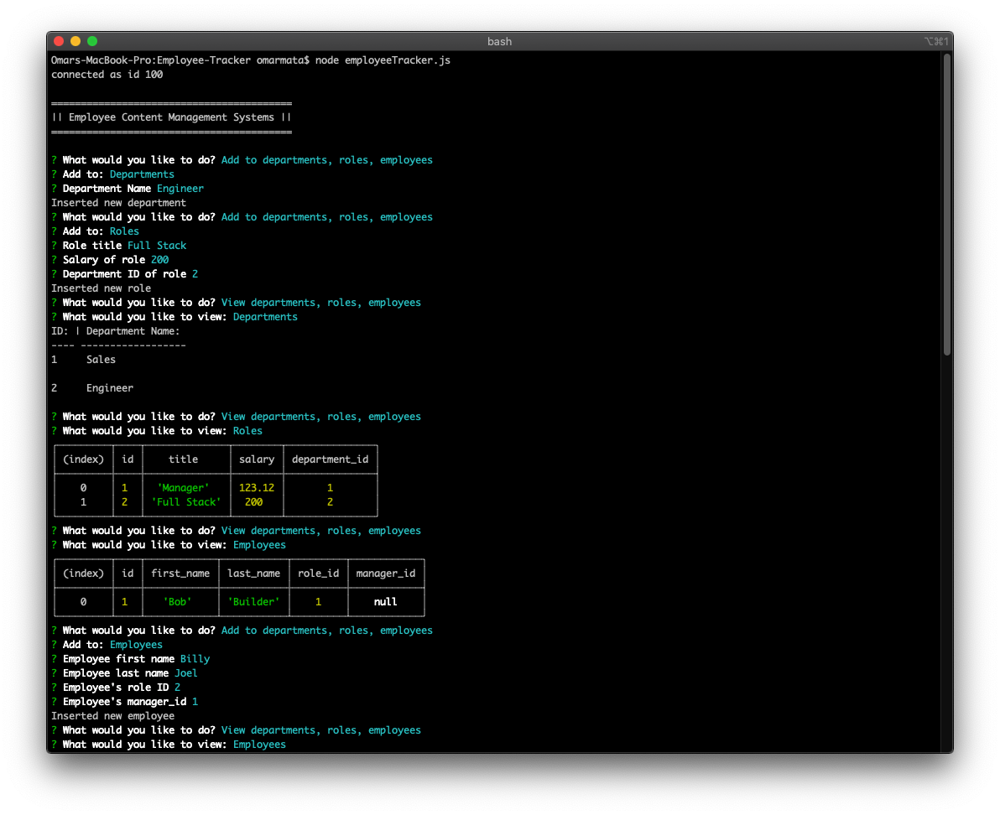
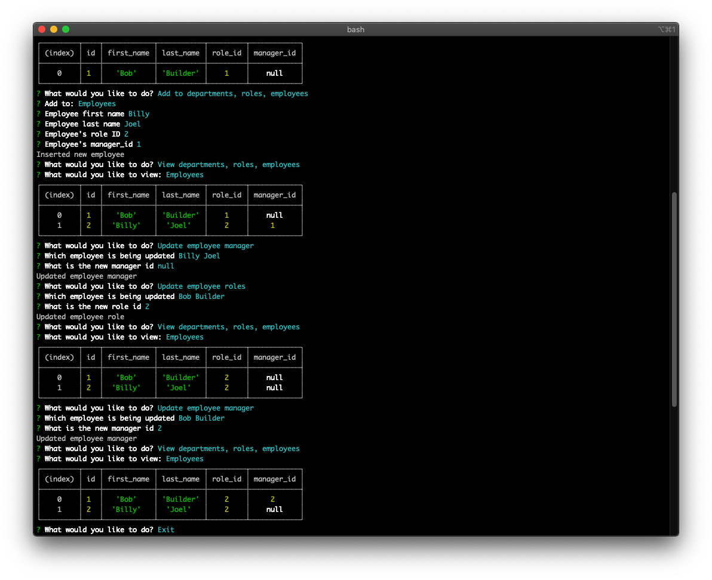

# Employee Tracker

 
  
## Description

Terminal run application for someone to easily interact with information stored in databases. This solution is specifically geared towards a organization that works from departments, to roles, to employees.


  
## Table of Contents
  
[Installation](#Installation)  
[Usage](#Usage)  
[License](#License)  
[Contributing](#Contributing)  
[Questions](#Questions)  
  
## Installation 
  
After forking the repo, need to run 
```
npm init
npm install mysql inquirer
```
  
## Usage
  
```
node employeeTracker.js
```

  
## License
  
Licensed under the [MIT](https://choosealicense.com/licenses/mit/) license.
  
## Contributing
  
Can fork and edit the repo with new ideas. For major updates, please open an issue first to discuss any changes.
  

## Questions

Link to my [GitHub Profile](https://github.com/omata48)
For additional questions feel free to email omata48@outlook.com
    